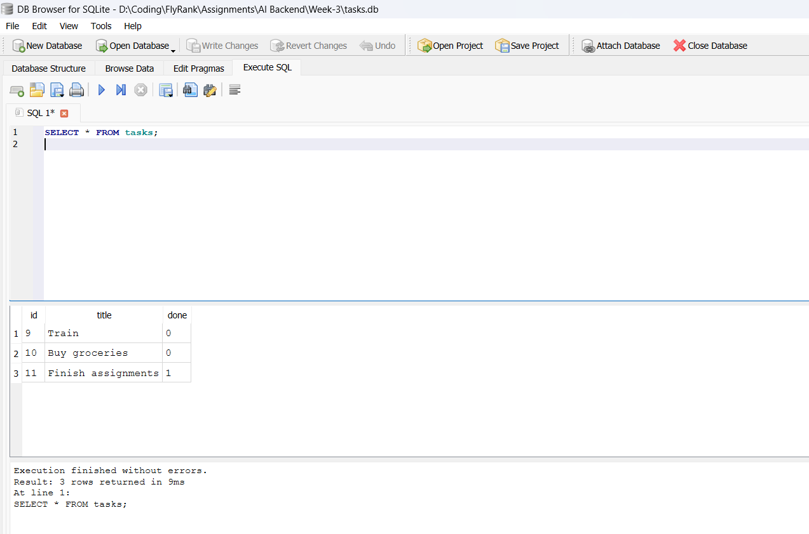

# flyrank-w3a1

Connecting CRUD to a database — the Week 2 to-do API, now backed by SQLite instead of an in-memory list.

## Why SQLite

- It's file-based and needs no separate database server to install or run — perfect for a small project like this.
- Python ships with the `sqlite3` module in its standard library, so there are no extra dependencies for the database driver itself.
- The whole database is a single portable file (`tasks.db`), which makes it trivial to inspect, back up, or reset while learning SQL.
- It's a natural stepping stone: the same SQL used here (`SELECT`, `INSERT`, `UPDATE`, `DELETE`) carries over almost unchanged to PostgreSQL/MySQL later — only the connection setup changes.

## Where the database lives

The database file is `tasks.db` in the project root (next to `main.py`). It is created automatically the first time the app starts (see `init_db()` in [db.py](db.py)):

- the `tasks` table is created if it doesn't already exist
- three example tasks are inserted only if the table is empty

`tasks.db` is intentionally listed in [.gitignore](.gitignore) — each clone of the repo generates its own fresh database on first run rather than shipping one in version control.

## How to start the project

```bash
pip install -r requirements.txt
uvicorn main:app --reload
```

The API is then available at `http://127.0.0.1:8000`. On the very first run this creates `tasks.db` and seeds it with three example tasks; on every later run your existing tasks are loaded instead.

### Endpoints (unchanged from Assignment 1)

| Method | Path             | Description                          |
|--------|------------------|---------------------------------------|
| GET    | `/tasks`         | List all tasks                        |
| GET    | `/tasks/{id}`    | Get one task (404 if missing)         |
| POST   | `/tasks`         | Create a task (400 if title missing)  |
| PUT    | `/tasks/{id}`    | Update a task's title and/or done     |
| DELETE | `/tasks/{id}`    | Delete a task                         |

## Database viewer

Opened `tasks.db` in DB Browser for SQLite to explore the data directly:



## Example SQL query

Ran the exploration queries from the assignment directly against `tasks.db` and confirmed each change was immediately visible through the running API (no restart needed):

```sql
SELECT * FROM tasks WHERE done = 1;
```

Output:

```
(7, 'Finish assignments', 1)
(8, 'Write README', 1)
```

Also verified:
- `UPDATE tasks SET done = 1;` followed by `DELETE FROM tasks WHERE done = 1;` emptied the table, and `GET /tasks` immediately returned `[]`.
- Restarting the app afterward re-seeded the three example tasks automatically, since `init_db()` only seeds when the table is empty — data created by the API (not seeded) survives restarts as long as the table isn't empty.
